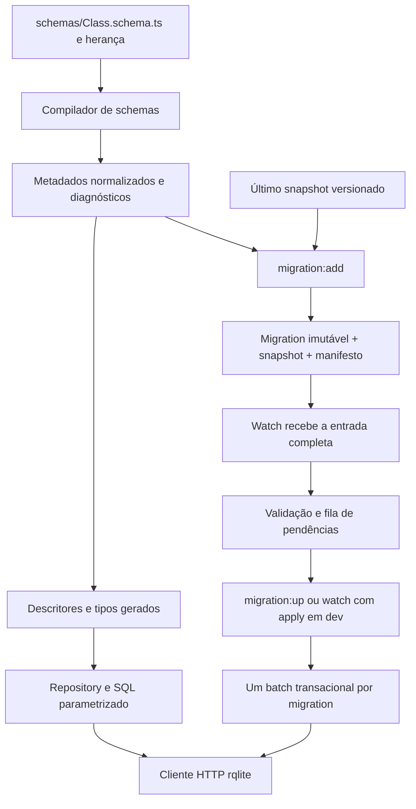

# Plano: schemas declarativos, migrations e pacote rqlite-orm

> Registro histórico. A nomenclatura e a estratégia de baseline desta versão foram
> substituídas pela [padronização rqlite-client](rqlite-client-standardization.md).
> O fluxo atual cria as tabelas pelos decorators em banco vazio; uso em
> [RQLITE_CLIENT.md](../RQLITE_CLIENT.md). Os resultados abaixo descrevem a etapa anterior.

Data: 24/09/2026. Estado: registro histórico da primeira implementação. O roteiro original abaixo permanece como contexto; comandos e estado atuais em [RQLITE_CLIENT.md](../RQLITE_CLIENT.md).

Este arquivo é o documento de passagem para outra conta/sessão e foi ampliado para permitir continuidade sem acesso à conversa original. As seções 1–14 registram a arquitetura, o fluxo e a análise; as seções 15–22 contêm o roteiro operacional, contratos internos, tarefas e pontos de retomada.

**Leitura inicial recomendada:** seção 15 (estado e contexto), seção 16 (requisitos versus decisões propostas), seções 3–10 (arquitetura), seção 18 (tarefas executáveis) e seção 19 (validação).

**Situação do Git:** este Markdown e parte substancial do código transferido estão sem commit. Trocar de conta nesta mesma pasta mantém os arquivos locais; abrir um clone novo do remoto não recupera automaticamente esse trabalho. Não tratar somente o nome da branch ou o commit de base como um backup dos arquivos pendentes.

## 1. Preparação executada e escopo

- Repositório de trabalho: `C:\Projects\cubs-backend`.
- Nova branch ativa: `feat/rqlite-orm-schema-migrations`, criada a partir de `325a378491feefd4a507698df27522d95d12296e`.
- Backup preservado: `C:\Users\H3\.codex\worktrees\fix-bugs-e-melhorias\cubs-backend`, na branch `fix/bugs-e-melhorias`.
- Transferidos o commit que estava à frente da main, 47 arquivos modificados e 65 arquivos novos ainda sem commit. Os 318 arquivos rastreados ou não ignorados da origem foram inicialmente conferidos por SHA-256, com igualdade byte a byte no destino. Depois, arquivos sem alteração de conteúdo foram rematerializados com os finais de linha do checkout Windows para evitar falsos indicadores no Git; a equivalência de conteúdo foi conferida novamente.
- A referência `main` continua em `9518718623833004ecf43c75bd348219b46a27c7`. Nenhum commit, push, migration no banco ou publicação npm foi feito.
- Arquivos locais ignorados, como `.env`, dependências e saídas de build, não integram a transferência de código. As dependências do destino foram instaladas com `npm ci` a partir do lockfile copiado.

Entrega desta etapa: este plano. A implementação do ORM, a conversão dos schemas e a publicação são etapas futuras. A worktree preserva o trabalho local, mas compartilha o armazenamento Git do repositório; não equivale a um backup externo independente.

## 2. Resultado desejado

Cada tabela será descrita por uma classe em `src/models/schemas/[Class].schema.ts`. Atributos e decorators definirão colunas, tipos, nulabilidade, identidade, defaults, índices e constraints. Classes base permitirão herdar atributos, sem criar tabelas adicionais ou hierarquias de joins.

Um compilador produzirá uma representação canônica do schema, tipos de entrada/saída e descritores para o runtime. `migration:add` será o gatilho que compara o estado desejado com o último snapshot versionado e materializa a pilha da mudança. O watch atualizará diagnósticos e acompanhará migrations prontas; a aplicação no rqlite continuará sendo uma operação explícita ou um modo de desenvolvimento configurado.

O motor genérico será extraído como `rqlite-orm`, consumível por `npm install rqlite-orm` após publicação. O Cub's continuará dono dos seus schemas, migrations, autorização e regras de negócio.



## 3. Diagnóstico do código recebido

| Peça atual | Evidência e consequência para o desenho |
| --- | --- |
| `src/models/schemas/index.ts` | Interfaces do namespace `Schema`; não descrevem DDL em runtime e também misturam entidades, DTOs e tipos de filtros. Converter apenas entidades persistidas; manter DTOs separados. |
| `src/models/schemas/entity-base.ts` | `EntityBase` declara `Date`, enquanto o cliente recebe strings e não realiza hidratação de datas. A nova camada deverá declarar a representação real e preservar o contrato HTTP. |
| `src/models/*-model.ts` | Repetem nome de tabela, `jsonColumns` e estratégia de exclusão. Essa configuração passará ao descritor gerado do schema. |
| `src/core/db/model.ts` | Gera ULID, trata CRUD e leitura após escrita. As guardas transacionais inserem deliberadamente em `pages` para provocar rollback quando uma operação não altera linhas: acoplamento de domínio que não pode ir ao pacote. |
| `src/core/db/sql-builder.ts` | Bind de valores e validação de identificadores já existem. Campos gerenciados e `updated_at` estão fixos por nome; passarão a ser dirigidos por metadata. |
| `src/core/db/shared.ts` | Normaliza respostas para arrays/booleanos; resultados DDL vazios podem desaparecer da lista. O pacote precisa preservar um resultado para cada statement, incluindo DDL e escrita sem efeito. |
| `src/utils/sendRequest.ts` | Converte falha de transporte em `null`. O novo cliente deve distinguir erro HTTP, erro SQL e resultado de commit desconhecido. |
| `src/core/db/migrator.ts` | Ordena arquivos, lê `_migrations(id, applied_at)` e aplica `up` mais registro no mesmo batch transacional. Preservar essa atomicidade e a história existente. |
| `src/core/scripts/create-migration.ts` | Produz um template vazio por timestamp. Será substituído por geração a partir de diferença entre schemas; manter um modo manual para backfills. |
| `src/core/db/migrations/` | Histórico append-only com renomes, reconstruções, índices parciais, FKs compostas e migrations de dados. Não pode ser substituído por um simples `CREATE TABLE` dos schemas atuais. |
| `tsconfig.json` e `package.json` | O estado transferido usa TypeScript 7.0.2, `tsx`, ESM e não habilita `experimentalDecorators`. A importação local de `typescript` não oferece `createProgram`, `createWatchProgram` ou `createSourceFile`. |
| `docker/rqlite/` | Imagem fixada em rqlite 10.3.3. O entrypoint não passa `-fk`; isso não confirma a configuração de um servidor já em execução. O plano precisa verificar capacidades e enforcement real. |

Há particularidades físicas que a conversão precisa preservar: IDs declarados como `BLOB` em algumas tabelas e `TEXT` em outras, colunas `JSON`, timestamps antigos sem tipo declarado, nulabilidade heterogênea e tabelas sem o trio `id/created_at/updated_at`. `access_invite_acceptances`, por exemplo, usa `accepted_at`.

## 4. Decisão sobre inferência: compilação estática

Recomendação: ler a árvore sintática e os tipos das classes em desenvolvimento/build, gerando metadata explícita. Decorators expressam regras; o runtime consome o resultado compilado. Não instanciar classes nem importar o servidor para descobrir tabelas.

Isso permite resolver herança, aliases e `string | null`, mantendo os tipos disponíveis antes de serem apagados da saída JavaScript. O esbuild não implementa `emitDecoratorMetadata`; decorators modernos também têm contrato diferente dos experimentais. Portanto, reflexão implícita não será a base do ORM. Fontes: [limitações do esbuild](https://esbuild.github.io/content-types/#typescript-caveats) e [decorators no TypeScript](https://www.typescriptlang.org/docs/handbook/release-notes/typescript-5-0.html).

O CLI terá um adaptador `SchemaCompiler` isolado. Na primeira versão, usar uma dependência interna com alias, por exemplo `typescript-compiler: npm:typescript@6.0.3`, para a API JavaScript de análise. O consumidor continua usando seu TypeScript 7.0.2. A documentação oficial restringe a API tradicional à série anterior à 7 e prevê uma API diferente na 7.1: [Compiler API](https://github.com/microsoft/TypeScript/wiki/Using-the-Compiler-API).

O spike inicial deve provar essa composição antes de construir o diff. Criar um programa restrito aos schemas e suas dependências, com opções próprias de análise; não repassar cegamente todas as opções do compilador 7 para o compilador 6. Sintaxe futura não suportada nos schemas produz diagnóstico claro. Evitar `ts-patch`, transformers globais e regex para interpretar TypeScript.

Os decorators públicos usarão a assinatura moderna. A descoberta estática reconhece imports por símbolo do pacote, inclusive aliases. Seus argumentos aceitam literais, constantes resolvíveis e helpers conhecidos; chamadas arbitrárias, getters e variáveis de ambiente em definições estruturais serão recusados. A mesma entrada deve gerar o mesmo schema em qualquer máquina.

### Exemplo da API desejada

```ts
// src/models/schemas/Base.schema.ts — contrato proposto
import {
  MappedSuperclass, Column, PrimaryKey, NotNull,
  Generated, CreatedAt, UpdatedAt, Default, sql,
} from 'rqlite-orm/schema';

@MappedSuperclass()
export abstract class IdentitySchema {
  @Column()
  @PrimaryKey()
  @NotNull()
  @Generated('ulid')
  id!: string;
}

@MappedSuperclass()
export abstract class BaseSchema extends IdentitySchema {
  @Column()
  @NotNull()
  @CreatedAt()
  @Default(sql.currentTimestamp())
  created_at!: string;

  @Column()
  @NotNull()
  @UpdatedAt()
  @Default(sql.currentTimestamp())
  updated_at!: string;
}
```

```ts
// src/models/schemas/Document.schema.ts — entidade ilustrativa nova
import { Table, Column, NotNull, Index, Json } from 'rqlite-orm/schema';
import { BaseSchema } from './Base.schema.js';

@Table('documents')
@Index('idx_documents_owner', ['owner_id'])
export class DocumentSchema extends BaseSchema {
  @Column()
  title!: string | null;

  @Column()
  @NotNull()
  owner_id!: string;

  @Column()
  @Json()
  data!: Record<string, unknown> | null;
}
```

`IdentitySchema` fornece somente identidade; `BaseSchema` acrescenta os relógios; `SoftDeleteSchema` pode acrescentar `deleted_at` e a política de exclusão. Uma classe abstrata não cria tabela. Herança significa copiar e validar colunas no descritor final da classe concreta.

O exemplo não determina um rebuild das tabelas atuais. Para o baseline do Cub's, usar bases de compatibilidade com as definições físicas legadas; compartilhar uma base somente quando tipo, default e nulabilidade coincidirem. Uniformizar IDs ou relógios será uma migration independente, se desejada.

### Regras de atributos e decorators

| Declaração | Interpretação proposta |
| --- | --- |
| Atributo com `@Column()` ou decorator persistente reconhecido | Entra no schema. Métodos, estáticos, privados e atributos sem marcação não entram. |
| `string` | `TEXT`, obrigatório por padrão no schema novo. |
| `number` | `REAL`; `@Integer()` determina `INTEGER` e valida entrada inteira. |
| `boolean` | `INTEGER` com codec booleano e `CHECK` 0/1. |
| `T \| null` | Coluna nullable; `@NotNull()` contraditório gera erro. |
| `campo?: T` | Recusar no MVP para coluna persistida; usar `T \| null` para null SQL e defaults para omissão no INSERT. |
| União de literais do mesmo tipo | Tipo escalar mais `CHECK IN (...)`; na adoção legada, só materializar constraints já existentes. |
| `Date`, objeto, array, `unknown`, união heterogênea | Exigir codec/tipo explícito; não adivinhar formato de persistência. |
| `@Json()` | Codec JSON; tipo físico configurável para preservar `JSON` legado ou usar `TEXT` em tabelas novas. |
| `@PrimaryKey()` | PRIMARY KEY e NOT NULL explícitos para schemas novos; suportar composição no nível de tabela. |
| `@Generated('ulid')` | Default de aplicação via gerador registrado; não é um default SQL. |
| `@Default(0)` / `@Default(sql.currentTimestamp())` | Distinguir valor literal de expressão SQL permitida. Nunca tratar uma string recebida no payload como SQL. |
| `@CreatedAt()` / `@UpdatedAt()` | Gerenciamento por metadata; `updated_at` só entra em tabelas que o declaram. |
| `@Unique`, `@Index`, `@Check`, `@ForeignKey` | Nomes estáveis; suportar constraints compostas, índices parciais e ações de FK. |
| `@Transient()` | Exclusão explícita, útil para propriedades auxiliares de classes. |

Também validar ciclos de herança, tabelas/colunas duplicadas, referências ausentes, índices inválidos, duas identidades incompatíveis e redefinição acidental de atributo herdado. Mudança intencional de metadata herdada exige declaração explícita de override; nunca alterar a metadata compartilhada de uma classe irmã.

O compilador gera `Row`, `Insert` e `Update` por schema: campos com default/gerador são opcionais no INSERT; campos gerenciados não entram no UPDATE; demais campos obrigatórios continuam obrigatórios. Omitir um campo deve ativar seu default; `null` explícito deve continuar `null`. O runtime valida essas regras também para consumidores JavaScript.

Separar entidade persistida de DTO público. `UserSchema` pode descrever `password_hash`, mas o serializer HTTP de usuário deve continuar excluindo credenciais. Decorators de persistência não determinam permissões ou exposição HTTP.

## 5. Estrutura e fronteiras do pacote

Desenvolver inicialmente em `packages/rqlite-orm/` neste repositório, com build/test/package.json próprios e sem imports de `@/`, Express, Socket.IO ou schemas do Cub's. Isso mantém a extração e a adoção revisáveis na mesma branch. Depois, o mesmo diretório pode virar um repositório independente sem mudar a API pública.

```text
packages/rqlite-orm/
  src/
    schema/          decorators, tipos e contrato da metadata
    compiler/        leitura de classes, herança e emissão de descritores
    dialect/         regras SQLite/rqlite e geração parametrizada
    client/          HTTP, resultados, consistência, timeouts e erros
    repository/      CRUD, codecs, campos gerenciados e exclusão
    migrations/      snapshots, diff, planner, runner e histórico
    cli/             config, comandos, watch e diagnósticos
  tests/             compilador, runtime e integração rqlite
  package.json
  tsconfig.json
  README.md
  LICENSE

src/models/schemas/
  Base.schema.ts
  User.schema.ts
  Page.schema.ts
  ...
  index.ts           compatibilidade temporária do namespace Schema
  inputs.ts          inputs HTTP; não são schemas de tabela

src/core/db/
  orm.ts             composição do cliente e plugins do Cub's
  generated/         descritores e tipos gerados, versionados
  migrations/        migrations históricas e novas, append-only
    meta/            baseline, snapshots e manifesto da cadeia
  *-store.ts         SQL e operações do domínio, continuam no Cub's

rqlite-orm.config.ts
```

Exports propostos: `rqlite-orm` (cliente/repository), `rqlite-orm/schema` (decorators), `rqlite-orm/migrations` (runner) e `rqlite-orm/config` (configuração do CLI). Binário: `rqlite-orm`. O compiler não será importado pelo caminho do runtime nem exigido para executar migrations compiladas em produção.

O pacote terá tipos próprios exportados para `SqlStatement`, `Migration`, resultados e erros; nenhum tipo global implícito do Cub's. Geradores, codecs e logger entram por configuração. A URL vem do construtor/configuração, sem dependência de `DB_RAFT_URL` ou nomes de env particulares.

Ficam no Cub's: `page-activity`, escrita atômica de `pages.data`, codecs de valores de célula, ownership/RBAC, regras de convites, stores de domínio e publicação realtime pós-commit. `db.sqlRaw` continua como fachada parametrizada em `core/db`; a extração não autoriza espalhar execução de SQL por controllers.

## 6. Runtime e transações

O Repository utiliza descritores gerados, por exemplo `orm.repository(schemaRegistry.pages)`. Pode retornar objetos de dados tipados; não precisa instanciar classes, executar construtores ou criar um identity map no MVP.

Preservar criação com ID explícito para `workspaces.id == pages.id`, serialização por coluna, escopo de soft delete, clocks do banco, binds SQL e leitura confirmada após mutação. `%` não deve virar LIKE implicitamente na API nova: predicados explícitos `eq`, `like`, `isNull` etc. A fachada de compatibilidade mantém a semântica antiga até a migração dos consumidores.

Cada resposta do cliente mantém a posição do statement e discrimina query, execução e DDL, sem reduzir tudo a boolean. Erros incluem índice do statement e classificação, sem registrar credenciais ou payload sensível. Escrita com zero linhas é resultado válido; o domínio decide quando isso representa conflito.

O rqlite controla transações pelo parâmetro HTTP `transaction`; não oferece o contrato de uma conexão SQL mantida aberta entre chamadas. A API do ORM aceitará um batch declarativo. Não prometer `transaction(async tx => ...)` com consultas e decisões JavaScript intercaladas. [Documentação da API rqlite](https://rqlite.io/docs/api/api/).

Mutação e SELECT de confirmação ficam no mesmo `/db/request?transaction`. Guardas que precisam abortar o batch devem falhar dentro do SQL; detectar o problema em JavaScript depois da resposta não desfaz commit. Na primeira adoção, manter a guarda específica de `pages` no adaptador Cub's. Uma guarda genérica só entra no pacote depois de demonstrar rollback real em rqlite, usando mecanismo independente de tabelas do consumidor.

Timeout após envio pode significar commit desconhecido. Não repetir automaticamente INSERTs, DDL ou backfills. Para migrations, reconectar e consultar ID/checksum aplicado antes de decidir reaplicação. Para CRUD, expor esse estado ao chamador; política de idempotência pertence à operação.

## 7. O gatilho `migration:add` e a pilha gerada

Comando canônico proposto:

```sh
npx rqlite-orm migration:add "adicionar campo de exemplo"
```

Sequência:

1. Ler configuração, adquirir lock local de geração e carregar a cadeia versionada.
2. Compilar todos os schemas afetados e suas bases/imports; abortar em erro de tipos ou metadata.
3. Comparar o schema compilado com o snapshot da última migration gerada, incluindo migrations ainda não aplicadas. O banco local não é a fonte do diff.
4. Classificar operações e dependências. Sem diferença, terminar sem criar arquivos.
5. Resolver renomes por mapeamento explícito. Não inferir rename somente por semelhança de nomes.
6. Gerar SQL congelado, metadados de risco, dependências, checksum e snapshot de saída.
7. Publicar os arquivos de forma recuperável: temporários e rename por arquivo, manifesto da entrada escrito por último. O watch só aceita uma entrada completa presente no manifesto.
8. Emitir `migration:added`; encerrar ou continuar no watch se iniciado com essa opção.

Pilha proposta, preservando a pasta histórica:

```text
src/core/db/migrations/
  20261001123000123_<sufixo>_adicionar_campo.ts
  meta/
    20261001123000123_<sufixo>_adicionar_campo.snapshot.json
    journal.json
```

O ID terá timestamp UTC com milissegundos e sufixo para colisões. Cada entrada registra predecessor, hashes do schema de entrada/saída, checksum do conteúdo executável e versão do formato do gerador. Datas de geração, comentários e caminhos absolutos não alteram o hash estrutural. Nomes finais são validados e arquivos nunca são sobrescritos. Esse snapshot de estrutura do banco é independente dos snapshots de views que o Cub's armazena em `pages.data`.

Migrations novas carregam statements e metadata congelados: não importam classes atuais, codecs mutáveis ou o registry vivo. O checksum deve ser idêntico no `.ts` e no `.js` compilado, calculado sobre o payload canônico, não sobre os bytes emitidos pelo compilador.

Para backfills ou alterações não expressáveis pelo diff: `migration:add "descricao" --manual`. A entrada manual requer definição explícita do schema de saída ou afirmação verificável de que só altera dados. Um stub incompleto é bloqueado pelo validator e nunca aplicado pelo watch.

Branches concorrentes podem gerar duas migrations para o mesmo predecessor. A validação deve identificar a bifurcação; ordenar apenas pelo timestamp não resolve esse conflito. Antes de aplicar, linearizar as migrations ainda não distribuídas e gerar novamente seus snapshots; se já aplicadas, exigir uma migration de convergência com precondições explícitas.

## 8. Watch: comportamento observável

Separar dois eventos evita uma migration por tecla e define o significado de “add migration”:

| Evento | Ação |
| --- | --- |
| Alteração em `*.schema.ts`, base ou tipo importado | Recompilar incrementalmente, atualizar descritores válidos e mostrar diff pendente. Não avançar o snapshot histórico. |
| Execução de `migration:add` | Criar uma entrada completa e imutável na pilha. Esse é o gatilho de geração. |
| Nova entrada completa no manifesto de migrations | Validar, listar como pendente e enfileirar aplicação se `--apply` estiver habilitado em dev. |
| Edição/remoção de migration já aplicada | Detectar checksum/histórico divergente e parar a aplicação; nunca reexecutar silenciosamente. |
| Erro de compilação ou arquivo incompleto | Mostrar diagnóstico e manter aplicação bloqueada até a próxima entrada válida. |

Comandos propostos:

```sh
# Acompanha schemas e migrations; somente valida e gera descritores.
npx rqlite-orm watch

# Adiciona a migration, depois mantém o watch aberto.
npx rqlite-orm migration:add "descricao" --watch

# Ativa aplicação automática de novas entradas completas no alvo de dev.
npx rqlite-orm watch --apply --environment development

# Fluxo explícito equivalente, sem watcher.
npx rqlite-orm migration:status
npx rqlite-orm migration:up --environment development
```

Usar debounce, escrita estável, fila única e deduplicação por ID/checksum. Observar o grafo de dependências dos schemas, não só os arquivos com sufixo. Ignorar `dist`, temporários, descritores gerados e snapshots para evitar ciclos. A inicialização do watch faz um scan completo; eventos de filesystem não substituem a descoberta de pendências. Testar criação, rename atômico de editor e exclusão no Windows e no Linux.

O modo `--apply` exige um alvo identificado como desenvolvimento na configuração; apenas `NODE_ENV` não comprova o destino. Em produção, o CLI aceita aplicação explícita por job de deploy e não inicia autoapply. Rebuilds, backfills e operações destrutivas continuam classificados como manuais para o watch.

O servidor de desenvolvimento só reinicia para usar o novo schema após a aplicação bem-sucedida, quando esta for necessária. Em produção, `schema:check` valida que o hash exigido pelo artefato já está aplicado antes de iniciar uma versão que depende dele.

## 9. Diff e segurança de evolução no SQLite/rqlite

| Mudança | Estratégia |
| --- | --- |
| Criar tabela/índice simples | Geração automática após validação de dependências e capacidades. |
| Adicionar coluna nullable | `ALTER TABLE ADD COLUMN` quando compatível com a versão alvo. |
| Adicionar NOT NULL | Exigir default permitido e compatível com registros existentes ou plano de backfill. Não inventar valor de negócio. |
| Adicionar índice UNIQUE | Checar duplicatas e falhar com diagnóstico; não remover dados para satisfazer a constraint. |
| Renomear tabela/coluna | Mapeamento explícito, atualização de dependências e verificação do SQL produzido. |
| Mudar tipo, PK, FK, CHECK ou constraints incompatíveis | Planner de rebuild ou operação manual, conforme capacidades comprovadas. |
| Remover tabela/coluna, estreitar tipo ou nulabilidade | Plano destrutivo explícito, contagem de impacto e caminho de recuperação. |
| Dados sem alteração de schema | Migration manual; snapshot estrutural permanece igual. |

SQLite tem limitações de `ALTER TABLE`; algumas alterações exigem criar tabela nova, copiar dados e substituir a antiga, preservando índices, triggers e referências. Não editar `sqlite_schema` diretamente. [Documentação de ALTER TABLE](https://www.sqlite.org/lang_altertable.html).

No rqlite, esse procedimento precisa ser adaptado a um batch HTTP transacional e ao estado das FKs. Não transcrever `BEGIN/COMMIT` do roteiro SQLite nem alternar `PRAGMA foreign_keys` assumindo uma conexão persistente. Se não houver execução atômica comprovada para uma transformação com FKs ativas, o planner deve classificá-la como não automatizável nessa versão. Isso é um limite de capacidade documentado, não um SQL aproximado.

Inspecionar versão do rqlite/SQLite, `sqlite_schema`, `PRAGMA table_xinfo`, `index_list`, `index_xinfo` e `foreign_key_list` para baseline e drift. Preservar SQL de objetos que o parser ainda não representa; objetos opacos exigem manutenção manual, sem serem descartados.

`@ForeignKey` gera a declaração, mas não garante enforcement por si só. O rqlite habilita FKs por `-fk`, em todos os nós. O estado atual deve ser verificado antes de ativação; rodar `foreign_key_check` e ensaiar todo o histórico em base descartável. [Configuração oficial](https://rqlite.io/docs/guides/config/).

A execução de cada migration reúne DDL/DML, registro em `_migrations` e metadata auxiliar num único batch. Para concorrência, usar um único executor no deploy e uma guarda transacional no banco: o batch disputa um marcador exclusivo de aplicação, verifica predecessor/estado esperado e só então executa o conteúdo. Se dois runners concorrerem, um falha sem aplicar parcialmente. Um arquivo de lock local sozinho não protege processos em máquinas distintas.

## 10. Adoção do histórico existente

1. Preservar todas as migrations existentes, seus IDs e `_migrations(id, applied_at)`. Nenhuma migration aplicada será editada.
2. Reproduzir o histórico completo, incluindo `20260920143000_repair_literal_updated_at`, em rqlite descartável com a versão suportada. Comparar com uma cópia sanitizada de base existente.
3. Capturar o schema físico final como baseline e classificar objetos não representados. O baseline não reaplica CREATEs em instalações existentes nem registra como aplicadas migrations ausentes.
4. Modelar classes compatíveis com esse baseline e exigir diff estrutural vazio. Ajustar as classes ao banco nessa etapa, não o contrário.
5. Adicionar tabelas auxiliares do ORM por uma nova migration explícita: metadata/checksum e coordenação de execução, mantendo a tabela `_migrations` legada legível pelo adaptador.
6. Registrar no manifesto quais IDs legados têm checksum de referência. Esses hashes ancoram o código auditado na adoção; não provam quais bytes uma instalação antiga executou. Para esse passado, a evidência é a reconciliação do schema/dados.
7. Banco novo executa o histórico legado e depois as migrations do ORM. Banco existente executa somente as pendentes. As duas rotas devem chegar ao mesmo schema e às mesmas invariantes de dados.
8. Manter o carregador histórico enquanto houver imports de `../migrator.js` nos arquivos antigos. Migrations futuras usam um contrato versionado com compatibilidade mantida pelo pacote.

Escopo de modelagem: as 10 entidades hoje expostas em `src/models/index.ts`, mais `organization_roles`, `workspace_roles`, `page_roles`, as três tabelas `*_pending_requests`, `access_invites`, `access_invite_acceptances` e `account_verifications`. Confirmar esse inventário de 19 tabelas de domínio na introspecção; `_migrations` e tabelas internas do ORM são infraestrutura.

A camada de compatibilidade preserva `Schema.Page`, `Schema.User` e demais consumidores durante a conversão. Corrigir diferenças de tipagem de datas sem mudar o wire HTTP. Manter `VALUE_CODECS` como única fronteira do envelope `page_columns_values.data`; essa coluna não pode ganhar desserialização JSON automática por engano. A topologia de páginas, ULIDs explícitos, snapshots v2 e política de ownership continuam no domínio.

## 11. Plano de implementação com critérios de saída

| Etapa | Trabalho concreto | Critério de saída |
| --- | --- | --- |
| 0. Preparação | Branch, transferência e preservação da worktree. | Concluída; hashes iguais, main preservada e índice vazio. |
| 1. Spike do compilador | Classes base + duas classes irmãs; tipos nullable/JSON; decorator moderno; adaptador TypeScript isolado. | Saída idêntica em `tsx`/build, sem metadata vazando entre classes; erro claro para entrada não suportada; consumidor TS 7 continua compilando. |
| 2. Pacote mínimo e cliente | `packages/rqlite-orm`, exports, tipos, HTTP, parser de resultados, Repository e binds. | CRUD independente do Cub's em projeto consumidor de teste; nenhum import de domínio; DDL/zero rows/batches mistos preservam índices. |
| 3. Baseline e snapshots | Introspecção, representação canônica, manifesto e adaptador legado. | Reprodução completa em base vazia, comparação com base existente, schemas compatíveis com diff zero. |
| 4. Geração de migrations | `migration:add`, diff, dependências, classificação de risco, modo manual e escrita recuperável. | Repetir comando sem alteração não gera nada; snapshot da segunda migration parte da primeira mesmo se ambas estiverem pendentes. |
| 5. Runner | Histórico/checksum, concorrência, drift, batch atômico e commit desconhecido. | Falha em statement intermediário não deixa DDL/dados/history parciais; corrida de dois executores aplica uma única vez. |
| 6. Watch | Dependências, eventos add, manifesto como marcador de completude, fila e apply dev. | Saves parciais e eventos duplicados não aplicam arquivos incompletos nem reaplicam migrations; restart recupera pendências. |
| 7. Adoção gradual no Cub's | Converter entidades por grupos, manter fachada Model; depois migrar stores onde a API genérica agrega valor. | Mesmos contratos HTTP, transações, codecs, clocks e realtime pós-commit; sem regressões nos fluxos existentes. |
| 8. Publicação e consumo | Empacotamento, licença, README, CI, release candidata e instalação em consumidor limpo. | Pacote sem código/segredos do backend; instalação por tarball validada, depois por registry; Cub's consome versão publicada e travada no lockfile. |

Ordem de adoção sugerida: entidades simples (`users`/`organizations`, preservando DTOs públicos), workspaces/memberships, páginas/colunas/células e finalmente roles/convites/solicitações. Mudança de API do Repository e modernização física do banco serão entregas distintas para facilitar diagnóstico e reversão da aplicação.

Manter inicialmente `npm run migrate:create`, `migrate` e `migrate:prod` como aliases para o CLI novo. A imagem de produção continua executando migrations compiladas antes do servidor. O build do pacote e a geração dos descritores precedem o `tsc` do backend; ajustar o Dockerfile para copiar/buildar o pacote enquanto ele for local. Após publicação, a instalação npm passa a resolver esse conteúdo normalmente.

## 12. Validação necessária para a implementação

- Compiler: herança multinível, imports/aliases, duas subclasses independentes, overrides, nullable/default, tipos ambíguos, PK/FK composta, índices parciais e determinismo entre Windows/Linux.
- SQL: valores com aspas e payloads de injection, identificadores inválidos, defaults literais versus expressões, timestamps não gravados como a string `CURRENT_TIMESTAMP`, filtros e ausência de UPDATE/DELETE sem critério.
- Runtime: distinção entre omissão/null, criação com ID explícito, JSON por coluna, exclusão lógica, leitura após escrita e nenhuma exposição de credenciais em DTOs.
- Migrations: upgrade do legado e instalação vazia; erro no meio do batch; checksum divergente; duas execuções concorrentes; perda da resposta após commit; migration sem efeito estrutural; fork de predecessor e drift real do banco.
- Watch: gravação parcial, editor que usa rename, rajadas de eventos, erro de tipos, entrada manual incompleta, reinício do processo e recusa de autoapply em produção.
- rqlite real: testes em instância descartável fixada na versão alvo, inclusive FKs ativadas/desativadas, constraints, reconstruções suportadas e recuperação. Testes apenas com SQLite local não comprovam o protocolo HTTP/transacional.
- Cub's: suites existentes, `npx tsc --noEmit`, build, `test:sql-injection` e fluxos integrados de páginas/acesso/workspaces em base isolada; check do contrato realtime se a adoção tocar publishers ou DTOs. Browser smoke separado se algum contrato perceptível mudar.
- Distribuição: `npm pack --dry-run`, inspeção do tarball, instalação real do tarball num projeto vazio, ESM + declarations + CLI, execução de produção sem fontes TS e sem compilador carregado pelo runtime.

Não criar rollback automático com promessa de recuperar dados removidos. `down` pode existir onde for comprovadamente reversível; mudanças destrutivas usam migration corretiva ou restauração de backup previamente testada.

## 13. Caminho até `npm install rqlite-orm`

Em 24/09/2026, `npm view rqlite-orm ... --registry=https://registry.npmjs.org` retornou E404. Não foi localizado um pacote público com esse nome nessa consulta; isso não reserva o nome nem comprova que o registry permitirá registrá-lo.

O alvo continua sendo `name: "rqlite-orm"`, inicialmente em versão `0.1.0` candidata. Planejar `type: "module"`, `exports` com declarations, `bin`, `files` restrito a `dist`/README/LICENSE e versões explícitas. Não publicar o package.json raiz do backend, que é privado. A licença e o titular do pacote precisam ser definidos antes da primeira publicação.

Primeiro consumir o pacote por tarball local; isso exercita o conteúdo realmente distribuído e detecta aliases que só funcionam no monorepo. Depois validar release candidata instalada do registry. Publicação requer conta npm com permissão sobre o nome, configuração de release e autenticação; não faz parte da execução desta etapa de planejamento. Se o nome for recusado, apresentar um nome com escopo como alternativa, sem afirmar que seria o mesmo comando solicitado. [Publicação npm](https://docs.npmjs.com/cli/v7/commands/npm-publish/).

Definição de concluído do projeto futuro: um consumidor externo instala o pacote, declara classes com herança, gera duas migrations sucessivas, usa watch, aplica a pilha em rqlite e executa CRUD tipado; o Cub's usa o mesmo pacote com seus contratos preservados.

## 14. Evidências desta etapa

- Origem/destino: 318 arquivos inicialmente idênticos por SHA-256; conferência após normalização do checkout encontrou apenas diferenças de finais de linha em arquivos sem mudanças de conteúdo. Worktree de origem preservada.
- Git final: as mesmas 47 alterações rastreadas e 65 arquivos novos da origem, mais este plano no destino; nenhum arquivo staged. Nenhuma migration histórica tem mudança de conteúdo decorrente desta transferência.
- Instalação: `npm ci --no-audit --no-fund` concluído com o lockfile transferido.
- Typecheck: `npx tsc --noEmit` aprovado.
- Build: `npm run build` aprovado, incluindo resolução de aliases e cópia dos templates de e-mail.
- Testes: `npm test` — 48 arquivos aprovados e 1 ignorado; 231 testes aprovados e 7 ignorados. Os testes de integração habilitados por `RUN_RQLITE_INTEGRATION=1` não foram executados.
- Nenhum schema decorado, watcher ou pacote foi implementado nesta etapa; exemplos deste documento são propostas de contrato.
- Nenhum banco foi migrado, nenhum teste integrado com rqlite vivo ou browser smoke foi realizado. O nome npm foi somente consultado.

## 15. Guia de continuidade para outra conta

### 15.1 Pedido original e ponto de parada

O usuário pediu duas entregas: executar a preparação de uma branch no repositório principal a partir da worktree do backend, preservando a worktree como backup; e elaborar um plano completo para classes de schema com decorators, herança, geração/watch de migrations e extração de um pacote npm `rqlite-orm`.

A preparação foi executada. A implementação do ORM não começou. O pedido seguinte foi salvar um plano detalhado em Markdown para outra conta continuar. Esta ampliação é documentação; não cria os arquivos de implementação descritos nas seções seguintes.

Não é necessário refazer a transferência nem criar outra branch para recuperar o estado descrito. Começar pela inspeção do estado encontrado, pois a outra conta poderá chegar depois de novas alterações do usuário.

### 15.2 Estado reconfirmado ao ampliar este documento

| Item | Estado local em 24/09/2026 |
| --- | --- |
| Pasta de trabalho | `C:\Projects\cubs-backend` |
| Branch ativa | `feat/rqlite-orm-schema-migrations` |
| HEAD da branch | `325a378491feefd4a507698df27522d95d12296e` |
| Referência `main` | `9518718623833004ecf43c75bd348219b46a27c7` |
| Worktree preservada | `C:\Users\H3\.codex\worktrees\fix-bugs-e-melhorias\cubs-backend` |
| Branch da worktree | `fix/bugs-e-melhorias`, no mesmo HEAD de base |
| Alterações transferidas | 47 arquivos rastreados modificados e 65 arquivos não rastreados |
| Diferença adicional no destino | Este documento em `docs/plans/rqlite-orm-schema-migrations.md` |
| Staging | Vazio |
| `packages/rqlite-orm/` | Ainda não existe |
| `rqlite-orm.config.ts` | Ainda não existe |
| Schemas decorados / watch / CLI novo | Ainda não implementados |
| Migration de reparo recebida | `src/core/db/migrations/20260920143000_repair_literal_updated_at.ts`, ainda não rastreada; não foi aplicada nesta tarefa |

O Git também lista um registro antigo de worktree `.claude/worktrees/adoring-kalam-46bbea` marcado como `prunable`. Ele não foi usado como origem. Não remover ou tentar recuperá-lo como parte da implementação do ORM.

Os 47/65 arquivos fazem parte do trabalho recebido. Incluem refatorações de controllers, routes, serviços, stores, dependências e testes, além do reparo de timestamps. Não são arquivos gerados pelo novo ORM. A conta que continuar deve preservar esse conjunto e distinguir suas próprias alterações do ponto de partida.

### 15.3 Primeiros comandos, somente para inspecionar

```powershell
Set-Location -LiteralPath 'C:\Projects\cubs-backend'
git status --short --branch
git branch --show-current
git rev-parse HEAD
git diff --cached --name-only
git worktree list --porcelain
Get-Content -LiteralPath AGENTS.md
Get-Content -LiteralPath docs/plans/rqlite-orm-schema-migrations.md
Get-Content -LiteralPath package.json
Get-Content -LiteralPath tsconfig.json
```

Se o estado divergir do quadro, investigar a diferença e incorporar trabalho mais recente. Não usar reset, clean, stash, restauração de arquivos ou troca forçada de branch para fazer o checkout parecer com este documento. Nenhuma dessas ações é necessária para começar a leitura.

Se a outra conta trabalhar na mesma máquina/pasta, ela já encontrará as alterações locais. Se trabalhar em outro clone/máquina, precisará receber o conjunto completo de arquivos pendentes por um mecanismo de transferência escolhido pelo usuário. Somente este Markdown permite entender o plano, mas não substitui o código da worktree. Este pedido não realizou commit, push ou upload para transferir esse conjunto.

### 15.4 Configuração e instruções que merecem atenção

- O `AGENTS.md` local deve ser lido. Suas invariantes de domínio continuam válidas, mas alguns caminhos nele refletem a organização anterior: o código transferido concentra auth, HTTP e realtime em `src/services/`.
- A URL usada pelo código atual é montada em `src/constants/database.ts` com `DB_RAFT_HOST` e `DB_RAFT_PORT`, com defaults `localhost` e `8000`. Não assumir que referências antigas a `RQLITE_PORT` configuram esse cliente.
- `RQLITE_*` também aparece na configuração do container; não confundir endereço de anúncio do nó com endereço usado pelo cliente HTTP.
- `../cubs-frontend/CODEX.md`, mencionado no `AGENTS.md`, não foi encontrado neste checkout ao preparar a passagem. Se o trabalho passar a editar ou diagnosticar o frontend, procurar as instruções presentes naquele repositório e ler o contrato `docs/INTEGRACAO.md`; não inventar o conteúdo do arquivo ausente.
- Node requerido no package.json: `>=24.0.0 <25`; npm: `>=11.19.0 <13`. A preparação anterior usou Node 24.18.0 e npm 12.1.0. Confirmar o ambiente novo, sem atualizar versões por hábito.
- Dependências relevantes travadas no estado recebido: TypeScript 7.0.2, tsx 4.23.15, Vitest 5.0.1, squel 6.5.0 e tsc-alias 1.9.5.
- `.env`, credenciais, dados do rqlite, volume Docker e tokens não estão neste documento. Não exportá-los para o pacote, fixtures, logs ou documentação.

## 16. Requisitos do usuário e decisões propostas

Esta distinção evita tratar escolhas do plano como decisões de produto que o usuário já aprovou individualmente.

| Natureza | Conteúdo |
| --- | --- |
| Requisito explícito | Preservar a worktree de origem como backup e continuar em branch nova no repo principal. Já executado. |
| Requisito explícito | Schemas em arquivos `schemas/[Class].schema.ts`, usando atributos de classes e decorators para inferir tipos e regras como NOT NULL e PRIMARY KEY. |
| Requisito explícito | Herança de atributos, incluindo um `BaseSchema` com `id`, `created_at` e `updated_at`. |
| Requisito explícito | Fluxo com watch e gatilho de adicionar migration que crie a pilha necessária. |
| Requisito explícito | Extrair pacote `rqlite-orm` instalável via npm. |
| Requisito explícito desta entrega | Salvar documentação detalhada que outra conta consiga continuar. |
| Recomendação técnica | Inferência estática, descritores gerados e adaptador de Compiler API isolado; evitar depender de reflexão de tipos em runtime. |
| Recomendação técnica | Usar decorators modernos e publicar primeiro em ESM. |
| Recomendação técnica | Desenvolver o pacote em `packages/rqlite-orm/`, validar por tarball e publicar depois. |
| Recomendação técnica | `migration:add` materializa migration/snapshot/manifesto; o watcher de schemas mostra alterações, sem gerar uma migration por save. |
| Recomendação técnica | Autoapply opcional e restrito ao alvo de desenvolvimento; produção aplica por execução explícita. |
| Recomendação técnica | Rejeitar propriedades persistidas opcionais `?:` no MVP e usar nulabilidade/defaults explícitos. |

A conta que implementar pode ajustar a forma da API após o spike, desde que preserve os requisitos e registre o motivo. Não converter mudanças rotineiras de implementação em bloqueios de aprovação. As escolhas de titular/licença/publicação e o acesso ao destino real serão resolvidas quando forem necessárias.

Ficam fora do escopo inicial: ORM multibanco, Active Record com efeitos em construtores, lazy loading implícito, identity map, transações interativas entre chamadas HTTP, sincronização destrutiva automática no startup, redesenho de RBAC e mudanças de UI do Cub's.

## 17. Contratos internos a definir antes do diff

### 17.1 Metadata canônica

Criar um formato versionado de schema, independente da AST e das classes em runtime. O primeiro formato precisa representar:

| Estrutura | Campos/regras essenciais |
| --- | --- |
| Documento | `formatVersion`, tabelas, objetos opacos preservados, hash estrutural e capacidades requeridas. |
| Tabela | Nome SQL validado, identificação da classe de origem para diagnóstico, colunas, PK, FKs, índices, checks e opções físicas. |
| Coluna | Nome da propriedade e SQL, tipo declarado físico, afinidade, nullable, default, codec, geração e gerenciamento em INSERT/UPDATE. |
| Default | União discriminada entre literal, expressão SQL permitida e gerador de aplicação; não reduzir todos a string. |
| Índice | Nome estável, colunas/expressões ordenadas, unicidade, predicado parcial e collation quando existir. |
| FK | Colunas locais e referenciadas, tabela alvo, ações e regras de deferimento suportadas. |
| Diagnóstico | Código, arquivo, classe, propriedade, mensagem e sugestão de correção; caminhos de diagnóstico fora do hash. |

O tipo físico declarado e o tipo TypeScript não são o mesmo conceito. A representação precisa preservar `JSON`, `BLOB`, tipos ausentes no legado e constraints físicas sem transformar tudo em `TEXT` durante o baseline. O codec indica como a aplicação lê/escreve a coluna; a afinidade indica como o banco a trata.

Canonicalização deve ordenar conjuntos por identidade, mas preservar ordens semanticamente relevantes: posição das colunas em índices, PKs/FKs compostas e expressões. Comentários, paths absolutos e ordem de descoberta de arquivos ficam fora do hash. Não remover espaços de SQL com regex, pois isso pode alterar literais e expressões. Para objetos ainda opacos, usar uma representação conservadora e sinalizar comparação manual.

### 17.2 Compiler e emissão

Contrato conceitual: `SchemaCompiler.compile(config) -> { schema, descriptors, diagnostics, dependencies }`. O compilador não aplica migrations nem consulta o banco para decidir o significado das classes.

O emitter produz arquivos determinísticos e tipos de entrada/saída. Para combinar inference dos decorators com TypeScript, os tipos `Insert`/`Update` devem ser emitidos: o TypeScript não deduz que um atributo decorado com default pode ser omitido apenas porque esse decorator existe.

Não validar o spike somente com `tsc --noEmit`. Executar o JavaScript produzido em Node: sintaxe de decorators, aliases, extensão `.js` e target de compilação precisam funcionar no runtime efetivo. A configuração atual usa `target: esnext`; se ela preservar sintaxe não executável no Node alvo, definir um target apropriado nos módulos que forem gerados/compilados e validar o impacto.

Metadata gerada do runtime deve ser importável sem avaliar as classes originais e sem carregar o compilador. Um consumidor externo não pode precisar dos aliases internos do Cub's nem do seu tsconfig para usar o pacote.

### 17.3 Migration gerada e journal

Contrato mínimo proposto para cada entrada:

```text
formatVersion
id
description
parentId
beforeSchemaHash
afterSchemaHash
checksum
requiredCapabilities
risk: safe | manual | destructive
state: draft | ready
up: statements congelados
down: opcional, somente quando a reversão for comprovada
```

O journal é a ordem de dependências publicada, não o histórico aplicado no banco. `_migrations` e a metadata auxiliar registram o estado efetivamente aplicado. Não inferir que uma migration está aplicada porque seu snapshot existe no disco.

O runner valida `state: ready`, arquivos necessários, checksum, predecessor e capacidades. Entrada com `draft` nunca é executada; assim o modo manual pode criar um esqueleto editável sem risco de aplicação imediata pelo watch. Finalizar uma entrada manual deverá ser uma operação explícita do CLI ou validator, com atualização consistente de checksum/snapshot/journal.

Os comandos de checagem precisam separar três perguntas:

1. Os descritores gerados correspondem às classes atuais?
2. A cadeia de migrations corresponde ao snapshot esperado e está íntegra?
3. O banco alvo está no estado aplicado esperado, sem drift estrutural?

Ter hashes iguais em arquivos locais responde às duas primeiras somente quando a validação apropriada foi feita; não comprova a terceira.

### 17.4 Erros e resultados do runtime

Planejar erros tipados: configuração, schema inválido, SQL inválido, falha HTTP, erro SQL do servidor, constraint, drift, checksum, dependência de migration, capacidade ausente e commit desconhecido. A fachada Cub's converte esses erros para o padrão existente dos controllers/rotas; o pacote não retorna `res.status` nem define mensagens HTTP da aplicação.

O resultado do batch preserva a ordem dos statements e diferencia leitura, execução com/sem efeito e DDL. Não interpretar DDL bem-sucedido como falha por faltar `rows_affected`. Também não considerar uma resposta HTTP 200 prova suficiente de que todos os statements SQL deram certo.

## 18. Tarefas detalhadas para a implementação

Os caminhos nesta seção são arquivos a criar ou alterar no futuro. Marcar uma tarefa como concluída somente depois de preencher sua evidência na seção 22.

### F1 — Provar schemas e herança antes de integrar o backend

- [x] Criar a estrutura mínima de `packages/rqlite-orm` com package.json privado durante a exploração, exports de schema e configuração de teste própria.
- [x] Implementar as assinaturas propostas dos decorators e o adaptador do compilador em `src/schema/` e `src/compiler/` dentro do pacote.
- [x] Criar fixtures com classe base abstrata, duas subclasses irmãs, herança em três níveis, nullable, literal union, JSON e propriedade com alias importado.
- [x] Gerar metadata sem instanciar as classes nem executar código do servidor. Rejeitar argumentos estruturais não resolvíveis estaticamente.
- [x] Demonstrar que alterar a classe base modifica os dois descritores e que alterar uma subclasse não modifica a outra.
- [x] Demonstrar igualdade da saída no fluxo de dev e no fluxo compilado. Rodar um consumidor com TypeScript 7 mantendo o compilador interno isolado.
- [x] Registrar o formato canônico e os casos intencionalmente não suportados antes de seguir para geração de DDL.

Saída: prova executável da abordagem mais arriscada, com classes e metadata estáveis. Nenhuma tabela do Cub's muda nesta tarefa.

### F2 — Construir a fronteira reutilizável de acesso ao rqlite

- [x] Criar cliente configurável, formatos de statement e parser de respostas, reaproveitando o comportamento correto de `shared.ts` e corrigindo a perda de resultados DDL na API nova.
- [x] Implementar parametrização e validação de identificadores como fronteiras distintas. Preservar binds para todos os valores externos.
- [x] Implementar codecs, default de aplicação, default do banco e campos gerenciados pela metadata; não depender do nome fixo `updated_at` em toda tabela.
- [x] Oferecer Repository mínimo: create, find/findAll, update, delete, soft delete e mutação com leitura confirmada no mesmo batch.
- [x] Definir API declarativa de batches sem prometer transação interativa. Propagar zero rows como resultado, reservando falha obrigatória às regras do domínio.
- [x] Criar adaptador de compatibilidade do Model do Cub's; manter ali a guarda transacional dependente de `pages` até existir alternativa genérica comprovada.
- [x] Executar CRUD em tabela de fixture sem nenhuma tabela do Cub's. Esse teste detecta acoplamentos escondidos antes da extração.

Saída: pacote funcional em um consumidor mínimo e fachada compatível para a futura adoção.

### F3 — Reproduzir o legado e fechar o baseline

- [x] Provisionar rqlite descartável com a imagem/versionamento do projeto e destino de testes isolado.
- [x] Executar todas as migrations históricas em ordem, inclusive o reparo novo recebido na worktree. Não editar arquivos aplicados para facilitar essa reprodução.
- [x] Inventariar tabelas, tipos físicos, defaults, índices, FKs, checks, triggers e views realmente encontrados.
- [x] Conferir as 19 tabelas de domínio previstas e atualizar o inventário se houver objetos adicionais.
- [x] Criar classes de compatibilidade, distribuindo bases apenas onde as definições físicas forem equivalentes.
- [x] Conservar separação de modelos persistidos, DTOs públicos e inputs HTTP. Resolver divergências como `Date` versus string sem alterar silenciosamente o contrato externo.
- [ ] Comparar classes com o baseline: exigir diff vazio. Confrontar depois com uma cópia de dados existente disponibilizada para validação.
- [x] Definir a nova migration de infraestrutura para checksums/estado do ORM, sem substituir a história legada.

Saída: adoção inicial sem DDL corretivo involuntário e caminho reproduzível tanto de banco vazio quanto de banco existente.

### F4 — Implementar geração e pilha de migrations

- [x] Implementar diff por identidade estável, plano de operações e ordenação de dependências.
- [x] Implementar `migration:add`, modo sem diferenças, nomes/IDs sem colisão, mapeamento explícito de rename e classificação de risco.
- [x] Escrever migration, snapshot e journal com estratégia de publicação que tolere interrupção no meio; journal final é o marcador de entrada completa.
- [x] Impedir que SQL executável consulte os schemas vivos. Congelar statements e metadata por migration.
- [x] Implementar modo manual com estado draft e finalização verificável.
- [x] Gerar duas mudanças sucessivas sem aplicar a primeira; a segunda deve depender do snapshot da primeira.
- [x] Simular duas branches alterando o mesmo predecessor; o checker deve detectar a bifurcação, sem inventar uma ordem válida por timestamp.

Saída: geração repetível, revisável e sem dependência do estado particular do banco de cada desenvolvedor.

### F5 — Implementar execução, histórico e recuperação

- [x] Adicionar adapter para migrations antigas e loader que diferencie fonte `.ts`, compilado `.js`, `.d.ts` e sourcemaps.
- [x] Validar histórico, checksum, predecessor, capacidades e drift antes de executar a entrada.
- [x] Executar DDL/DML e atualização de histórico em um batch transacional; conservar rollback quando um statement falha.
- [x] Provar a guarda no banco com dois processos concorrentes, incluindo o caso em que ambos leram a migration como pendente.
- [x] Tratar falha de rede depois do envio: consultar o histórico confirmado antes de permitir reaplicação; não fazer retry cego.
- [x] Implementar dry run/status sem alteração de dados e erros legíveis com ID da migration e índice do statement.
- [x] Registrar limite de automação para rebuilds com FKs/objetos opacos; não anunciar suporte antes de teste real.

Saída: executor transacional com evidência de falha parcial, concorrência e recuperação em rqlite.

### F6 — Watch e integração com o ciclo de desenvolvimento

- [x] Observar schemas e dependências para diagnósticos/descritores e observar entradas completas para migrations.
- [x] Implementar debounce, deduplicação, scan inicial, recuperação depois de restart e uma única fila de aplicação.
- [x] Garantir que arquivo salvo parcialmente, migration draft e erro de tipos não disparem aplicação.
- [x] Não observar a própria saída gerada de modo que provoque loops de geração.
- [x] Separar modo somente watch e modo watch/apply. Validar o destino configurado antes de habilitar o segundo.
- [x] Integrar a ordem geração → migration necessária → reinício do servidor; não deixar o servidor reiniciar com descritor novo e tabela antiga.
- [x] Testar comportamento em Windows e Linux, inclusive editor que salva usando arquivo temporário e rename.

Saída: o comando de adicionar migration cria a pilha, e o watcher reage de maneira previsível a essa entrada.

### F7 — Migrar os consumidores do Cub's em grupos

- [x] Adicionar composição em `src/core/db/orm.ts`, registry gerado e aliases npm de compatibilidade.
- [x] Converter os arquivos `src/models/*-model.ts` progressivamente, preservando a API consumida pelos controllers durante a transição.
- [x] Preservar criação com ID explícito, clocks do banco e soft delete por tabela.
- [x] Manter stores de domínio em `core/db`; substituir somente a infraestrutura que tiver equivalente comprovado no pacote.
- [x] Conferir `page-json`, `page-activity`, células, hierarquia e exclusões transacionais após cada grupo de adoção.
- [x] Preservar autorização, DTOs e publicações realtime pós-commit. Não publicar eventos novos para fluxos de workspace que continuam somente HTTP.
- [x] Atualizar build, Dockerfile e execução de migrations compiladas; evitar importar compiler/dev tools no startup de produção.
- [ ] Remover as fachadas antigas somente após todos os consumidores migrarem e os testes de contrato passarem.

Saída: backend passa a consumir o ORM com comportamento de domínio preservado.

### F8 — Tornar o pacote distribuível por npm

- [x] Remover qualquer import do Cub's, segredo, env ou dependência de aliases locais do pacote.
- [ ] Definir licença, titular, versão candidata, documentação pública, matriz Node/TypeScript/rqlite e superfície de exports.
- [x] Gerar JavaScript e declarations; validar binário CLI e resolução ESM num consumidor limpo.
- [x] Inspecionar `npm pack --dry-run` e instalar o tarball produzido em um projeto fora da árvore do backend.
- [x] Nesse consumidor, declarar herança, gerar/aplicar duas migrations, executar watch e fazer CRUD. O teste não pode ser aprovado apenas porque o monorepo consegue resolver imports locais.
- [ ] Quando a publicação estiver autorizada e a conta npm configurada, confirmar novamente o nome e publicar a candidata.
- [ ] Instalar a versão publicada no Cub's, atualizar o lockfile e repetir a validação de produção.

Saída: o comando solicitado `npm install rqlite-orm` funciona a partir do registry e o backend usa essa distribuição.

## 19. Comandos existentes, comandos futuros e evidências

### 19.1 Comandos que já existem neste checkout

```powershell
# Typecheck: não aplica migrations.
npx tsc --noEmit

# Testes da suíte; a integração rqlite continua opt-in.
npm test

# Compilação e preparação dos artefatos de produção.
npm run build

# Recorte existente para verificar o core durante a extração.
npm test -- src/core/db/shared.test.ts src/core/db/model.transaction.test.ts src/core/db/sql-builder.timestamp.test.ts src/core/db/migrator.test.ts src/core/db/soft-delete-solution.test.ts
```

Se `node_modules` estiver ausente ou divergente do lockfile, executar `npm ci` antes desses comandos. Não rodar `npm install` para atualizar dependências ao acaso. Os scripts efetivos devem ser conferidos no package.json encontrado pela conta que continuar.

Também existem `npm run migrate:create`, `npm run migrate`, `npm run migrate:prod` e `npm run migrate:container`. Eles pertencem ao fluxo antigo neste momento. Os comandos de aplicação alteram o banco configurado e não devem ser usados para “ver se funciona” em uma base desconhecida.

Os validadores `scripts/validation/workspace-flow-test.ts`, `access-flow-test.ts` e `page-resource-flow-test.ts` criam dados e possuem proteção para `DB_RAFT_PORT=18012`. A integração em `src/core/db/scoped-access.integration.test.ts` exige `RUN_RQLITE_INTEGRATION=1` e essa mesma porta. A porta é uma verificação adicional; confirmar a identidade da instância descartável, não apenas o número.

Uma vez provisionada e migrada uma base descartável apropriada, o comando existente da suíte integrada pode ser chamado com variáveis somente no processo filho:

```powershell
node --input-type=module -e "import { spawnSync } from 'node:child_process'; const result = spawnSync(process.execPath, ['node_modules/vitest/vitest.mjs', 'run', 'src/core/db/scoped-access.integration.test.ts'], { stdio: 'inherit', env: { ...process.env, RUN_RQLITE_INTEGRATION: '1', DB_RAFT_HOST: '127.0.0.1', DB_RAFT_PORT: '18012' } }); if (result.error) throw result.error; process.exit(result.status ?? 1);"
```

Esse exemplo ainda não foi executado nesta etapa documental. Ele não provisiona nem migra a base. Inspecionar a versão do runner instalada antes de reutilizar o caminho `node_modules/vitest/vitest.mjs` em outro ambiente.

### 19.2 Comandos novos ainda propostos

| Comando futuro | Responsabilidade |
| --- | --- |
| `schema:generate` | Compilar classes e atualizar descritores/tipos determinísticos. |
| `schema:check` | Verificar coerência dos artefatos; checagem de banco deve exigir alvo explícito e distinguir drift de arquivo desatualizado. |
| `migration:add <descricao>` | Criar migration + snapshot + entrada de journal. |
| `migration:add <descricao> --manual` | Criar draft para backfill/plano manual. |
| `migration:finalize <id>` | Proposta para validar e fechar o draft manual; decidir a API definitiva em F4. |
| `migration:status` | Mostrar aplicadas, pendentes, entradas inválidas e divergências. |
| `migration:up` | Aplicar pendências prontas e compatíveis no destino escolhido. |
| `watch` | Acompanhar alterações, com `--apply` opt-in no alvo de dev. |

Não executar os exemplos `npx rqlite-orm ...` como se já existissem. Até haver pacote local preparado/publicado, `npx` pode tentar consultar ou baixar um nome no registry. Durante o desenvolvimento, usar o CLI compilado do pacote local, por exemplo `node packages/rqlite-orm/dist/cli/index.js ...`, quando esse arquivo passar a existir.

### 19.3 Matriz de evidências a manter

| Evidência | Preparação anterior | Ao continuar |
| --- | --- | --- |
| Igualdade do código transferido | Conferida; detalhes na seção 14. | Reinspecionar se a pasta mudou; não recopiá-la sobre mudanças novas. |
| Typecheck | Aprovado. | Rodar ao fechar mudanças de implementação. |
| Build | Aprovado. | Rodar ao alterar código, exports, geração, tsconfig ou empacotamento. |
| Suíte existente | 231 aprovados, 7 ignorados. | Registrar novos totais e explicar falhas herdadas versus regressões. |
| Integração rqlite opt-in | Não executada. | Executar em base isolada nas fases F3/F5/F7. |
| Rebuild/FK/concorrência | Não validados. | Exigem testes reais do novo runner. |
| Browser / contrato HTTP perceptível | Não verificados nesta tarefa. | Avaliar necessidade quando a implementação tocar consumidores externos. |
| Tarball / instalação externa | Pacote ainda inexistente. | Obrigatórios em F8. |
| Publicação npm | Não feita; consulta do nome retornou E404 na preparação. | Revalidar disponibilidade/permissão e registrar versão publicada. |

Resultados da preparação são evidência histórica deste ponto de partida, não validação automática de código que ainda será escrito. Não dizer que “todos os testes de integração passaram” enquanto houver testes ignorados ou fases não executadas.

## 20. Pontos de atenção para evitar regressões

| Armadilha | Conduta esperada |
| --- | --- |
| Tratar interfaces atuais como DDL completo | Conferir migrations/introspecção; as interfaces não contêm todas as constraints nem todas as tabelas. |
| Fazer todas as entidades herdarem a mesma base imediatamente | Primeiro preservar tipos físicos/defaults/nulabilidade. Tabelas de auditoria podem precisar só de identidade ou de bases próprias. |
| Importar `typescript` do consumidor esperando a API antiga | Usar o adaptador isolado e provar compatibilidade no spike. |
| Depender de decorator alterar automaticamente `Insert<T>` | Gerar os tipos a partir da metadata; testar omissão versus null/default. |
| Copiar `Model` integralmente para o pacote | Remover dependências de `pages`, globais de domínio, constantes de conexão e aliases. |
| Parsear JSON em toda coluna chamada `data` | Usar codec por coluna; `page_columns_values.data` precisa continuar texto para `VALUE_CODECS`. |
| Tornar `CURRENT_TIMESTAMP` um parâmetro string | Expressões SQL confiáveis possuem representação própria e são emitidas como expressão. |
| Fazer update/delete amplo por lookup vazio | Manter recusa na camada genérica e testes com consumidores JavaScript. |
| Tratar `created_at`/`updated_at` como Date sem codec | Preservar string recebida ou introduzir conversão explicitamente testada. |
| Gerar migration comparando com o banco pessoal do dev | Comparar com o snapshot versionado; usar introspecção para baseline e drift. |
| Marcar migration como aplicada antes do batch | History e alteração de dados precisam confirmar atomicamente. |
| Watch reagir à criação de um `.ts` vazio | Reagir à entrada completa pronta do journal. |
| Aplicar duas mudanças de schema durante um restart | Serializar aplicação e coordenar readiness do servidor. |
| Usar `down` como garantia de recuperação de dados | Documentar reversibilidade real e procedimento de restauração/forward fix. |
| Rerodar seed para preparar uma base compartilhada | Usar base descartável. O seed pode recriar usuários e invalidar a correspondência dos tokens existentes. |
| Confundir backup Git local com backup do banco | São recursos distintos; esta tarefa preservou código, não exportou dados do rqlite. |

## 21. Decisões restantes e primeiro passo recomendado

O primeiro passo de implementação recomendado é F1. A prova de inferência/herança decide se a API desejada é viável no toolchain atual antes de alterar o Model ou converter as 19 tabelas. Não começar pela execução automática de migrations.

Decisões a registrar durante a implementação, sem impedir essa prova inicial:

- API final dos decorators, incluindo alias em maiúsculas se desejado (`NOT_NULL`/`PRIMARY_KEY` descrevem constraints SQL no pedido, não impõem por si só a grafia TypeScript dos decorators).
- Semântica final do watch: a proposta é adicionar migration como gatilho de materialização e autoapply opcional; se o usuário preferir outro comportamento, atualizar seções 7/8 antes de implementá-lo.
- Perfil de compatibilidade do legado versus convenções padrão para tabelas novas; não acoplar sua modernização à primeira extração.
- Limites de rebuild automático na versão de rqlite alvo e solução comprovada para guardas genéricas/concorrência.
- Alcance da primeira versão: runtime + compiler + CLI em um pacote com exports separados é a proposta inicial; separar em vários pacotes só se o custo ou a distribuição justificarem.
- Matriz de versões suportadas e política de evolução do formato de metadata/migration.
- Titular npm, licença definitiva do pacote, repositório de publicação e credenciais do fluxo de release.

Mensagem sugerida para acompanhar o arquivo ao iniciar a implementação em outra conta:

> Leia integralmente `docs/plans/rqlite-orm-schema-migrations.md` no backend e confirme o estado local descrito na seção 15. A preparação da branch já foi executada; preserve a worktree de backup e todas as alterações pendentes recebidas. Continue a implementação a partir de F1, usando o plano como contexto e registrando decisões, evidências e próximo passo na seção 22. O ORM ainda não existe. A publicação e alterações em banco compartilhado não foram realizadas na etapa de planejamento. Não considere os exemplos do CLI como comandos já disponíveis.

## 22. Registro de continuidade

Atualizar esta seção ao concluir cada etapa ou ao passar novamente o trabalho. Não substituir as evidências anteriores por uma afirmação genérica de sucesso.

| Etapa | Estado nesta passagem | Evidência / próximo passo |
| --- | --- | --- |
| F0: preparação | Concluída | Branch e transferência preservadas; ver seções 1, 14 e 15. |
| Documentação de passagem | Concluída | Plano ampliado com roteiro independente da conversa. |
| F1: compiler/herança | Concluída | Compiler TS 6 isolado; consumidor TS 7; aliases, três níveis, irmãos e alteração da base; saída determinística em Windows/Linux. |
| F2: runtime/pacote mínimo | Concluída | Cliente/Repository independentes; binds, codecs, clocks, soft delete e leitura transacional; consumidor externo sem tabelas do Cub's. |
| F3: baseline legado | Validada com dados sintéticos | 23 migrations intactas; 19 tabelas e 28 índices; FK ligado/desligado; upgrade preserva dados. Cópia de produção não fornecida. |
| F4: geração de migrations | Concluída | Snapshot/journal, duas pendentes, rename explícito, draft/finalize, lock, checksums, detecção de fork e publicação incompleta. |
| F5: runner | Concluída para rqlite 10.3.3 | Rollback DDL/dados/histórico, dois processos concorrentes, resposta perdida pós-commit, drift e no-op; rebuilds complexos permanecem manuais. |
| F6: watch | Concluída | Windows/Linux, rename de arquivo, bloqueio de draft, reinício coordenado e destino dev explícito. |
| F7: adoção no Cub's | Concluída com fachada preservada | 10 Models usam registry; 238 testes do backend; HTTP e contrato realtime; startup Docker compilado com 24 migrations. |
| F8: npm | Tarball validado; publicação pendente | Candidata privada 0.1.0-rc.1 instalada fora da árvore em Windows/Linux. Titular/licença/registry ainda não definidos. |

Modelo de entrada para cada atualização futura:

```text
Data / etapa:
Branch e commit, se houver:
Arquivos criados ou alterados nesta etapa:
Decisões tomadas e motivo:
Comandos executados e resultados:
Instância de testes usada (sem segredos):
Verificações não executadas e motivo:
Problemas conhecidos ou limitações comprovadas:
Estado de migrations no banco de testes:
Próximo passo concreto:
```

Na ampliação documental de 24/09/2026, foram reconfirmados branch/HEAD, main, ausência de staging, 47 alterações rastreadas, 65 arquivos novos da origem e ausência do pacote/configuração futura. O único arquivo de trabalho editado nesta ampliação foi este Markdown; o backup permaneceu intacto. `npx tsc --noEmit` foi repetido nesta revisão e aprovado. A suíte e o build informados na seção 14 pertencem à preparação anterior e não foram repetidos apenas para expandir o texto. Foram conferidos os delimitadores das tabelas e dos blocos de código do Markdown.

### Execução de 24/09/2026

Implementados `packages/rqlite-orm`, configuração do workspace, 19 schemas de
compatibilidade, registry, baseline físico, runner, CLI/watch, adoção nos Models,
build/Docker e scripts de validação. A única migration adicionada nesta execução
foi `20260924000000_rqlite_orm_metadata`; o reparo `20260920143000` já fazia parte
do código recebido e foi preservado. Nenhum commit, push ou publicação foi feito.

| Verificação executada | Resultado |
| --- | --- |
| `npm test` com RUN_RQLITE_INTEGRATION=1, alvo 18012 | 49 arquivos, 238 testes aprovados; nenhum ignorado. |
| `npm run test:orm` com RUN_ORM_INTEGRATION=1, alvo 18015 vazio | 7 arquivos, 14 testes aprovados, incluindo transações reais e rename preservando dados. |
| `npm run test:orm-cubs` | 7 testes integrados, 9 verificações de SQL injection, workspace e smokes HTTP de páginas/acesso aprovados. |
| `npx tsc --noEmit` e `npm run build` | Aprovados; descriptors conferidos contra schemas/journal. |
| `npm run realtime:contract:check` | Contrato backend/frontend sincronizado. |
| Replay/upgrade | 23 migrations históricas + infraestrutura; catálogos iguais, dados sentinela preservados, timestamp literal reparado, repetição sem pendências. |
| FK | Replay com FK desligado e ligado; foreign_key_check vazio; catálogo validado no destino 18014. |
| Pacote externo | Tarball allowlist; Node 24.18 Windows e Node 24.21 Linux, TS 7; CRUD, defaults/codecs, dois processos e watch aprovados. |
| Docker real | Build aprovado; 24 migrations compiladas aplicadas do zero com FK ligado; health live/ready 200; restart sem migration pendente; import de compiler/tsx proibido pelo teste. |
| CI | Workflow criado com actions fixadas por SHA; execução remota no GitHub não realizada. |

Instâncias exclusivamente descartáveis do Compose `cubs-orm-test`: baseline
18012, upgrade 18013, foreign-keys 18014, package 18015, consumer 18016 e production
sem porta publicada. Usam tmpfs. O banco normal `cubs-rqlite` e os volumes reais
permaneceram intactos. O backend de smoke usou 3008; o container usou 18018 e foi
removido ao concluir. Relatórios: `artifacts/orm-validation/consumer-win32.json`,
`consumer-linux.json`, `container.json`, `container.log`, `server.log` e
`pack-inspection.json`; tarball `rqlite-orm-0.1.0-rc.1.tgz` no mesmo diretório.

Decisões e limites: apenas DDL de compatibilidade comprovado foi automatizado.
Rebuilds/FKs/CHECKs e objetos opacos exigem SQL manual ensaiado e catálogo final
verificado. O rqlite reescreve `strftime(..., 'now')` em CREATE TABLE e congela o
default; o gerador rejeita esse caso e o Repository avalia clocks em cada escrita.
O Model/SQLBuilder continua como fachada porque os consumidores e guardas de domínio
dependem de sua API. Não foi validado failover multinó nem UI em browser nesta execução;
os contratos externos foram exercitados via HTTP. A cópia de dados legados usada foi
sintética, não um backup de produção.

Próximo passo externo: definir titular, licença e repositório npm, configurar
credenciais, revalidar disponibilidade do nome e publicar a candidata. Até isso
acontecer, `npm install rqlite-orm` a partir do registry não faz parte da entrega;
o Cub's consome o workspace e o tarball é instalável localmente.
